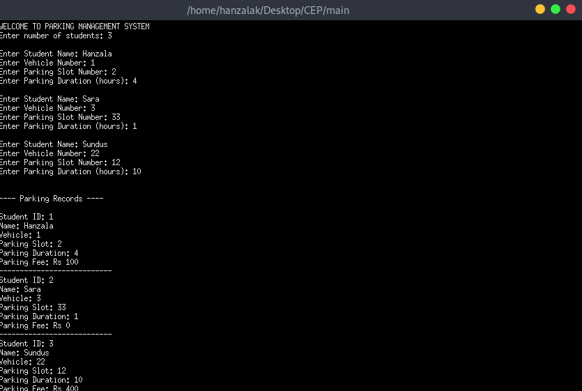

# Parking Management System

A console-based parking management system built in C++ for managing student vehicle parking on campus. This project was developed as a Computer Engineering Project (CEP).

## Features

- Register multiple students with their vehicle and parking details
- Assign parking slot numbers to each student
- Automatically calculate parking fees based on duration
- Display all parking records

## Fee Structure

| Duration       | Fee          |
| -------------- | ------------ |
| Up to 2 hours  | Free         |
| Beyond 2 hours | Rs 50/hour   |

## Data Structures Used

- **`Parking`** — stores slot number, duration, and calculated fee
- **`Student`** — stores student ID, name, vehicle number, and associated parking info

## How to Build & Run

```bash
g++ main.cpp -o main
./main
```

## Sample Output



## Tech Stack

- **Language:** C++
- **Compiler:** g++
